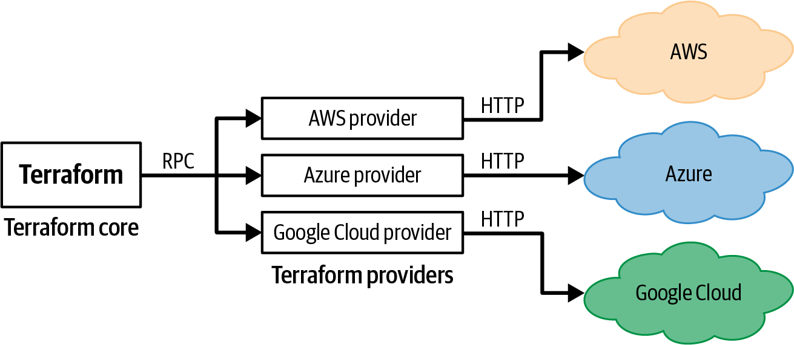

# Chapter 7. WORKING WITH MULTIPLE PROVIDERS

So far, every all our example has include only a single `provider` block

```t
provider "" {
  region = "ap-southeast-1"
}
```

This `provider` block configures our Terraform code to deploy to a single AWS region in a single AWS account.

## Working with One Provider

### What Is a Provider?

Terraform consists of 2 parts:

- Terraform **Core**

  It's the `terraform` binary that provides all the basic functionality of Terraform:

  - The CLI (i.e. `init`,`plan`, `apply`...)
  - A parser and interpreter for Terrafrom code (HCL)
  - The ability to build a dependency graph from resources and data sources
  - Logic to read and write state files
  - ...

  The [source code](https://github.com/hashicorp/terraform) is written in Go.

- Terraform **Providers**: plugins for Terraform Core

  Each provider implements a specific interface to communicate with their corresponding platforms.

  

  Terraform **core** communicates with **providers** via _remote procedure calls_ (RPCs).

  Those **providers**, in turn, communicate with their corresponding platforms via the network (e.g. via HTTP calls)

  Each provider claims a specific `prefix` (e.g. `aws_`, `azurerm_`), and exposes _resources_ and _data sources_ whose names start with that prefix

  Although HashiCorp created most of the initial providers for major providers. Nowadays, each providers is maintained by the company behind these platforms.
  e.g.

  - AWS employees work on AWS Provider
  - Microsoft employees work on Azure Provider

### How Do You Install Providers?

Just add a `provider` block, and run `terraform init`

```t
provider "aws" {
  region = "ap-southeast-1"
}
```

```shell
$ terraform init # # Terraform will automatically download the code for the provider

Initializing provider plugins...
- Finding hashicorp/aws versions matching "4.19.0"...
- Installing hashicorp/aws v4.19.0...
- Installed hashicorp/aws v4.19.0 (signed by HashiCorp)
```

> ❓ How does Terraform know what provider, which version, where to download?
>
> Each Terraform module is declared with providers it requires, so when a root module use them, Terraform know how to install and use them.
>
> It's called [`Provider Requirements`](https://developer.hashicorp.com/terraform/language/providers/requirements), and has the syntax:
>
> ```t
> terraform {
>   required_providers {
>     <LOCAL_NAME> = {
>       source  = "<URL>"
>       version = "<VERSION>"
>     }
>   }
> }
> ```
>
> where:
>
> - `LOCAL_NAME`: the _local name_ to use for the provider in this module.
> - `URL`: the URL from where Terraform should download the provider
>
>   The URL has the format `[<HOSTNAME>/]<NAMESPACE>/<TYPE>`
>
>   - `HOSTNAME` (optional): hostname of a Terraform Registry that distribute the provider.
>
>     If hostname is omitted, Terraform will by default download the provider from he public Terraform Registry.
>
>   - `NAMESPACE`: the organization namespace (typically, a company name).
>   - `TYPE`: the name of the platform this provider manges (typically, `TYPE` is the _preferred local name_)
>
>   e.g.
>
>   - `registry.terraform.io/hashicorp/aws`
>   - `hashicorp/aws`
>
> - `VERSION`: a version constraint:
>   - A specific version such as `4.19.0`
>   - A version range such as `> 4.0, < 4.3`

When we only used a `provider` block without the `provider requirements` (the `required_providers` block) and run `terraform init`, Terraform will:

- Make an assumption that:
  - the `HOSTNAME` is the public Terraform Registry (`registry.terraform.io`)
  - the `NAMESPACE` is `hashicorp`
- Then try to download the provider at the URL `registry.terraform.io/hashicorpt/<PROVIDER_LOCAL_NAME>`

### How Do You Use Providers?

```t
# Specify which provider to use
terraform {
  required_providers {
    aws = {
      source  = "hashicorp/aws"
      version = "~> 4.0"
    }
  }
}

# Configure that provider
provider "aws" {
  region = "ap-southeast-1"
}
```

Once the provider is configured, all _resources_ and _data sources_ from that provider will automatically use that configuration.

> ❔ Can we deploy some resources into one region, and some other resources to another region?
>
> e.g. Deploy the AWS Certificate Manager (ACM)'s certificate to `us-east-1`, and CloudFront's distribution to `ap-southeast-1`

## Working with Multiple Copies of the Same Provider

> **alias**: A custom local name for a provider
>
> e.g.
>
> ```t
> provider "aws" {
>   region = "ap-southeast-1"
>   alias  = "main"
> }
> ```

> Pass **alias** to `provider` Meta argument of [resources](https://developer.hashicorp.com/terraform/language/meta-arguments/resource-provider), [data sources](https://developer.hashicorp.com/terraform/language/data-sources#meta-arguments), [modules](https://developer.hashicorp.com/terraform/language/meta-arguments/module-providers) to tell them to use the configuration in that particular provider
>
> e.g.
>
> ```t
> data "aws_region" "main" {
>   provider = aws.main
> }
> ```

### Working with Multiple AWS Regions

#### Multiple AWS Regions for data sources

```t
provider "aws" {
  region = "ap-southeast-1"
}

data "aws_region" "main" {
}

output "region" {
  description = "The name of the region"
  value       = data.aws_region.main.name
}
```

```shell
💲 terraform apply
data.aws_region.main: Reading...
data.aws_region.main: Read complete after 0s [id=ap-southeast-1]

Changes to Outputs:
  + region = "ap-southeast-1"

# ...

Apply complete! Resources: 0 added, 0 changed, 0 destroyed.

Outputs:

region = "ap-southeast-1"
```

- Let's add `provider` to `aws_region` data source

  ```t
  data "aws_region" "main" {
    # Refer to the default provider configuration of this platform
    provider = aws # This works the same way as when the provider is omitted (Because we have only one provider of this platform (aws))
  }
  ```

  ```shell
  💲 terraform plan
  data.aws_region.main: Reading...
  data.aws_region.main: Read complete after 0s [id=ap-southeast-1]

  No changes. Your infrastructure matches the configuration.
  ```

- Let' use an alias for the provider

  ```t
  provider "aws" {
    region = "ap-southeast-1"
    alias  = "main"
  }

  data "aws_region" "main" {
    # provider
    provider = aws      # We can refer to the provider with it's preferred local name.
    provider = aws.main # or with its alias, or omit the provider
  }
  ```

  ```shell
  💲 terraform plan
  data.aws_region.main: Reading...
  data.aws_region.main: Read complete after 0s [id=ap-southeast-1]

  No changes. Your infrastructure matches the configuration.

  Terraform has compared your real infrastructure against your configuration and found no differences, so no changes are needed.
  ```

- How about we add another provider?

  ```t
  provider "aws" {
    region = "ap-southeast-1"
    alias  = "main"
  }

  provider "aws" {
    region = "us-east-1"
    alias  = "secondary"
  }

  data "aws_region" "main" {
    provider = aws
  }

  output "region" {
    description = "The name of the region"
    value       = data.aws_region.main.name
  }
  ```

  ```shell
  💲 terraform plan
  data.aws_region.main: Reading...
  data.aws_region.main: Read complete after 0s [id=ap-southeast-1]

  No changes. Your infrastructure matches the configuration.
  ```

- Let's add another `aws_region` data source

  ```t
  data "aws_region" "secondary" {
  }
  ```

  ```shell
  💲  terraform plan
  data.aws_region.main: Reading...
  data.aws_region.secondary: Reading...
  data.aws_region.main: Read complete after 0s [id=ap-southeast-1]
  data.aws_region.secondary: Read complete after 0s [id=ap-southeast-1]

  Changes to Outputs:
    + region_secondary = "ap-southeast-1"
  ```

All of them may work, but we can NOT make sure of the outcome. The recommend is

- If it's the only one provider from that platform, don't use alias.

  Terraform will select provider configuration based on the resource type name prefix (e.g. `aws_region` -> `aws`) and use the [default configuration](https://developer.hashicorp.com/terraform/language/providers/configuration#default-provider-configurations)

- When we need another provider from the same platform:

  - give it an [alias](https://developer.hashicorp.com/terraform/language/providers/configuration#alias-multiple-provider-configurations).
  - refer to the alternative provider by using [`provider` meta-argument](https://developer.hashicorp.com/terraform/language/meta-arguments/resource-provider)

  e.g.

  ```t
  # The default provider configuration; resources that begin with `aws_` will use
  # it as the default, and it can be referenced as `aws` (preferred local name).
  provider "aws" {
    region = "ap-southeast-1"
  }

  # Additional provider configuration for use-east-1 region; resources can
  # reference this as `aws.secondary`.
  provider "aws" {
    region = "us-east-1"
    alias  = "secondary"
  }

  data "aws_region" "main" {
  }

  data "aws_region" "secondary" {
    provider = aws.secondary
  }

  output "region" {
    description = "The name of the region"
    value       = data.aws_region.main.name
  }

  output "region_secondary" {
    description = "The name of the secondary region"
    value       = data.aws_region.secondary.name
  }
  ```

  ```shell
  💲 terraform apply
  data.aws_region.main: Reading...
  data.aws_region.main: Read complete after 0s [id=ap-southeast-1]
  data.aws_region.secondary: Reading...
  data.aws_region.secondary: Read complete after 0s [id=us-east-1]

  Changes to Outputs:
    + region_secondary = "us-east-1"

  # ...

  Apply complete! Resources: 0 added, 0 changed, 0 destroyed.

  Outputs:

  region = "ap-southeast-1"
  region_secondary = "us-east-1"
  ```

#### Multiple AWS Regions for resources

The technique for data sources work with resources too.

```t
provider "aws" {
  region = "us-east-2"
  alias  = "region_1"
}

provider "aws" {
  region = "us-west-1"
  alias  = "region_2"
}

resource "aws_instance" "region_1" {
  provider = aws.region_1

  ami           = "ami-0fb653ca2d3203ac1" # Note different AMI IDs!!
  instance_type = "t2.micro"
}

resource "aws_instance" "region_2" {
  provider = aws.region_2

  ami           = "ami-01f87c43e618bf8f0" # Note different AMI IDs!!
  instance_type = "t2.micro"
}
```

AMI IDs are different for each regions. Let's tell Terraform find it.

```t
resource "aws_instance" "region_1" {
  provider = aws.region_1

  ami           = data.aws_ami.ubuntu_region_1.id
  instance_type = "t2.micro"
}

resource "aws_instance" "region_2" {
  provider = aws.region_2

  ami           = data.aws_ami.ubuntu_region_2.id
  instance_type = "t2.micro"
}


data "aws_ami" "ubuntu_region_1" {
  provider = aws.region_1

  most_recent = true
  owners      = ["099720109477"] # Canonical

  filter {
    name   = "name"
    values = ["ubuntu/images/hvm-ssd/ubuntu-focal-20.04-amd64-server-*"]
  }
}

data "aws_ami" "ubuntu_region_2" {
  provider = aws.region_2

  most_recent = true
  owners      = ["099720109477"] # Canonical

  filter {
    name   = "name"
    values = ["ubuntu/images/hvm-ssd/ubuntu-focal-20.04-amd64-server-*"]
  }
}
```

#### Multiple AWS Regions for modules

Let's turn our example into a reusable `mysql` module that supports replication.

```t
# modules/data-stores/mysql/variables.tf
variable "backup_retention_period" {
  description = "Days to retain backups. Must be > 0 to enable replication."
  type        = number
  default     = null
}

variable "replicate_source_db" {
  description = "If specified, replicate the RDS database at the given ARN."
  type        = string
  default     = null
}

variable "db_name" {
  description = "Name for the DB."
  type        = string
  default     = null
}

variable "db_username" {
  description = "Username for the DB."
  type        = string
  sensitive   = true
  default     = null
}

variable "db_password" {
  description = "Password for the DB."
  type        = string
  sensitive   = true
  default     = null
}
```

```t
# modules/data-stores/mysql/main.tf
terraform {
  required_providers {
    aws = {
      source  = "hashicorp/aws"
      version = "~> 5.0"
    }
  }
}

resource "aws_db_instance" "example" {
  identifier_prefix   = "terraform-up-and-running"
  allocated_storage   = 10
  instance_class      = "db.t2.micro"
  skip_final_snapshot = true

  # Enable backups
  backup_retention_period = var.backup_retention_period

  # If specified, this DB will be a replica
  replicate_source_db = var.replicate_source_db

  # Only set these params if replicate_source_db is not set
  engine   = var.replicate_source_db == null ? "mysql" : null
  db_name  = var.replicate_source_db == null ? var.db_name : null
  username = var.replicate_source_db == null ? var.db_username : null
  password = var.replicate_source_db == null ? var.db_password : null
}
```

```t
# modules/data-stores/mysql/outputs.tf
output "arn" {
  value       = aws_db_instance.example.arn
  description = "The ARN of the database"
}
```

And use our module to create a production environment

```t
# live/prod/data-stores/mysql/variables.tf
variable "db_username" {
  description = "The username for the database"
  type        = string
  sensitive   = true
}

variable "db_password" {
  description = "The password for the database"
  type        = string
  sensitive   = true
}
```

```t
# live/prod/data-stores/mysql/main.tf

provider "aws" {
  region = "ap-southeast-1"
  alias  = "primary"
}

provider "aws" {
  region = "us-east-1"
  alias  = "replica"
}

module "mysql_primary" {
  source = "../../../../modules/data-stores/mysql"

  # With modules, providers is a map. A module may contain multiple data sources and resources from multiple providers
  providers = {
    aws = aws.primary
  }

  db_name     = "prod_db"
  db_username = var.db_username
  db_password = var.db_password

  # Must be enabled to support replication
  backup_retention_period = 1
}

module "mysql_replica" {
  source = "../../../../modules/data-stores/mysql"

  providers = {
    aws = aws.replica
  }

  # Make this a replica of the primary
  replicate_source_db = module.mysql_primary.arn
}
```

```t
# live/prod/data-stores/mysql/outputs.tf
output "primary_address" {
  value       = module.mysql_primary.address
  description = "Connect to the primary database at this endpoint"
}

output "primary_port" {
  value       = module.mysql_primary.port
  description = "The port the primary database is listening on"
}

output "primary_arn" {
  value       = module.mysql_primary.arn
  description = "The ARN of the primary database"
}

output "replica_address" {
  value       = module.mysql_replica.address
  description = "Connect to the replica database at this endpoint"
}

output "replica_port" {
  value       = module.mysql_replica.port
  description = "The port the replica database is listening on"
}

output "replica_arn" {
  value       = module.mysql_replica.arn
  description = "The ARN of the replica database"
}
```

Deploying resources across multiple regions with Terraform is pretty easy, but:

1. Multi-region is hard especially in "active-active" mode.

   There are many hard problems:

   - Latency between region
   - Decide between one writer or multiple writers
   - Generate unique IDs
   - Meet local data regulations
   - ...

2. Use aliases sparingly

   If we use a single Terraform module that uses aliases to deploy in multi-regions, when one of those regions is down, any attempt to run `plan`, `apply` will fail.

   Keep environments completely isolated: instead of ~~managing multiple regions in one module~~ with aliases, _manage each region in separate modules_

> ❔ **When to use aliases?**
>
> When the infrastructure we're deploying across several aliased providers is truly couple, and they need to be deployed together.
>
> e.g. Use Amazon CloudFront and provision a TLS certificate with AWS Certification Manager

### Working with Multiple AWS Accounts

It's common to use multiple AWS accounts, each for an environment.

The benefits:

- Isolation

  Limit the "blast radius" when things go wrong.

- Authentication and Authorization

  If everything is in one account, it's very easy to accidentally grant access to the wrong things.

- Auditing are reporting

### Creating Modules That Can Work with Multiple Providers

> Two Types of Terraform Modules:
>
> 1. _Reusable modules_: low-level modules that to be combined with other modules, resources, data sources.
>
> 2. _Root modules_: high-level modules that combine multiple reusable modules into a single unit, that will be run with `apply`.

> ❓ Where should we define the `provider` block when creating reusable modules?
>
> Defining `provider` block within reusable modules is an anti-pattern:
>
> - Configuration problems
>
>   Some provider has 50 configuration options. 🤯
>
> - Duplication problems
>
>   None wants to pass 50 settings every time they use your module.
>
> - Performance problems
>
>   For every `provider` block, Terraform spins up a new process to run that provider, and communicate with that process via RPC, each process will make hundred of API an RPC calls.
>
> As best practice, the module consumers will create the `provider` blocks in their root modules.

> ❓ How do we build a reusable modules for multiple providers without defining `provider` blocks in it?
>
> Use [_configuration aliases_](https://developer.hashicorp.com/terraform/language/modules/develop/providers#provider-aliases-within-modules).
>
> e.g.
>
> ```t
> terraform {
>   required_providers {
>     aws = {
>       source                = "hashicorp/aws"
>       version               = "~> 5.0"
>       configuration_aliases = [aws.alternative] # Inside this module, resources can refer both aws and aws.alternative provider using the `provider` argument
>     }
>   }
> }
> ```

```t
# modules/multi-account/main.tf (Reusable module)
terraform {
  required_providers {
    aws = {
      source                = "hashicorp/aws"
      version               = "~> 4.0"
      configuration_aliases = [aws.parent, aws.child]
    }
  }
}

data "aws_caller_identity" "parent" {
  provider = aws.parent
}

data "aws_caller_identity" "child" {
  provider = aws.child
}
```

```t
# examples/multi-account-module/main.tf (Root module)

# Define the providers
provider "aws" {
  region = "us-east-2"
  alias  = "parent"
}

provider "aws" {
  region = "us-east-2"
  alias  = "child"

  assume_role {
    role_arn = "arn:aws:iam::222222222222:role/OrganizationAccountAccessRole"
  }
}

module "multi_account_example" {
  source = "../../modules/multi-account"

  # Pass the providers to module
  providers = {
    aws.parent = aws.parent # The keys in providers map must match module required_providers configuration_aliases
    aws.child  = aws.child
  }
}
```

## Working with Multiple Providers from different platforms (multi-cloud)

### A Crash Course on Docker

Run a container from an image

```shell
# docker run <IMAGE> [COMMAND]
$ docker run -it ubuntu:20.04 bash # Use -it flag for interactive shell

# Confirm that we're running ubuntu
$ cat /etc/os-release
```

List all docker containers (running and stopped)

```shell
$ docker ps -a
```

Run an example web app

```shell
$ docker run -p 5000:5000 training/webapp
# * Running on http://0.0.0.0:5000/ (Press CTRL+C to quit)


$ curl localhost:5000
# Hello world!
```

Cleanup containers

```shell
$ docker rm <CONTAINER_ID> # Use docker ps to get CONTAINER_ID
```

### A Crash Course on Kubernetes

> ❔ **What is Kubernetes (K8s)?**
>
> **Kubernetes**: orchestration tool for running, managing Docker containers:
>
> - scheduling
> - auto healing
> - auto scaling
> - load balancing
>
>   and much more.

> ❔ **What is the basic architecture of Kubernetes?**
>
> Kubernetes consists of two main pieces:
>
> - Control plan 🧠
>
>   - Managing the Kubernetes cluster
>
>     - Storing the cluster state
>     - Monitoring containers
>     - Scheduling containers to worker nodes
>
>   - Running the API server so we can control the cluster with:
>     - CLI (kubectl)
>     - Web UI (Kubernetes Dashboard)
>     - IaC (Terraform)
>
> - Worker nodes 🤚🤚: the servers used to actually run our containers

> ❔ **Where can Kubernetes run?**
>
> Anywhere: On the cloud, in on-premises data center, on our PC.

> ❔ **How to run K8s cluster with Docker Desktop?**
>
> 1. Install Docker Desktop and enable K8s.
>
> 2. Use kubectl to interact with the cluster:
>
> - Config `kubectl`: Docker Desktop did it for us
>
> - Tell `kubectl` to use the that config
>
>   ```shell
>   $ kubectl config use-context docker-desktop
>   ```
>
> - Check the cluster nodes
>
>   ```shell
>   $ kubectl get nodes
>   ```

> ❔ **How does Kubernetes work?**
>
> The Control Plane runs a _reconciliation loop_, which:
>
> - continuously checks the Kubernetes _objects_ (which tell Kubernetes our intent)
> - works to make the state of our cluster match our intent.

> ❔ **What is Kubernetes Deployment?**
>
> A declarative way to manage an application in Kubernetes:
>
> - Which Docker images to run
> - How many copies of them to run (called _replicas_)
> - Settings for those images: CPU, memory, ports, environment variables...
> - Strategy to roll out updates to those images

> ❔ **What is Kubernetes Service?**
>
> A way to expose a web app running in Kubernetes as a networked service.
>
> K8s will configure a load balancer to:
>
> - Expose a public endpoint
> - Distribute traffic from that endpoint across the replicas in a K8s Deployment.

> ❔ **How to describe what we want to K8s?**
>
> Create an _K8s object_ (in YAML) that defines what we want, and submit that object to K8s via `kubectl apply`.

> ❔ **How to define an K8s object?**
>
> - Define the K8s object directly in YAML.
> - Use an alternative tool: Helm, Terraform.

> ? **How to deploy an app in K8s with Terraform?**

Let's deploy an K8s app named `k8s-app`.

```t
# modules/services/k8s-app/variables.tf
variable "name" {
  description = "The name to use for all resources created by this module"
  type        = string
}

variable "image" {
  description = "The Docker image to run"
  type        = string
}

variable "container_port" {
  description = "The port the Docker image listens on"
  type        = number
}

variable "replicas" {
  description = "How many replicas to run"
  type        = number
}

variable "environment_variables" {
  description = "Environment variables to set for the app"
  type        = map(string)
  default     = {}
}
```

```t
# modules/services/k8s-app/main.tf

terraform {
  required_version = ">= 1.0.0, < 2.0.0"

  required_providers {
    kubernetes = {                     # A new provider: kubernetes
      source  = "hashicorp/kubernetes" #
      version = "~> 2.0"
    }
  }
}

resource "kubernetes_deployment" "app" {
  metadata {                                     # Deployment Metadata: used to identify and target a K8s object in API calls
    name = var.name                              #
  }                                              #
  spec {                                         # Deployment Spec
    replicas = var.replicas                      #
    template {                                   ## Pod Template (Pod is a group of containers that meant to be deployed together)
      metadata {                                 #
        labels = local.pod_labels                ## Pod Labels: used to identify the Pods
      }                                          #
      spec {                                     ## Pod Spec
        container {                              ## Pod Container: A container inside this Pod
          name  = var.name                       ### Container Name
          image = var.image                      ### Conatiner Image
          port {                                 ### Container Port
            container_port = var.container_port  #
          }                                      #
          dynamic "env" {                        ### Container Envs (Using dynamic block with for_each to create a bunch of env blocks)
            for_each = var.environment_variables #
            content {                            #
              name  = env.key                    #
              value = env.value                  #
            }                                    #
          }                                      #
        }                                        #
      }                                          #
    }                                            #
    selector {                                   ## Pod Selector: tells K8s Deployment to target the Pods defined within this Deployment
      match_labels = local.pod_labels            #? Why don't it automatically target these Pods? Because K8s is an flexibe and decoupled system.
    }                                            #? It's possible for a Deployment to manage Pods defined somewhere.
  }
}

resource "kubernetes_service" "app" {  #
  metadata {                           # Service Metadata:  Just as with the Deployment object
    name = var.name                    #
  }                                    #
  spec {                               # Service Spec
    type = "LoadBalancer"              ## Service Type: the type of deployed load balancer will depend on the cluster configures.
    port {                             ## Service Port:
      port        = 80                 ### - Route traffic on port 80
      target_port = var.container_port ### - to the port the container is listening on
      protocol    = "TCP"              #
    }                                  #
    selector = local.pod_labels        ## Service Selector: Just as with the Deployment object
  }
}S
```

```t
# modules/services/k8s-app/outputs.tf

locals {
  status = kubernetes_service.app.status                                       # We're only working with K8s Service status
}                                                                              #
output "service_endpoint" {                                                    #
  description = "The K8S Service endpoint"                                     #
  value = try(                                                                 # try function
    "http://${local.status[0]["load_balancer"][0]["ingress"][0]["hostname"]}", ## extract the host name from Service status
    "(error parsing hostname from status)"                                     ## fallback message if there is any error
  )                                                                            #
}
```

> A Service of type LoadBalancer status is a complicated JSON object

```jsonc
[
  {
    load_balancer = [
      {
        ingress = [
          {
            hostname = "<HOSTNAME>"
          }
        ]
      }
    ]
  }
]
```

> What does Terraform `try` function do?
>
> `try` function evaluates all the arguments and return the first argument that doesn't produce any errors.
>
> ```t
> try(ARG1, ARG2, ..., ARGN)
> ```

Let's use our module

```t
# examples/kubernetes-local/main.tf

provider "kubernetes" {
  config_path    = "~/.kube/config"
  config_context = "docker-desktop"
}

module "simple_webapp" {
  source = "../../modules/services/k8s-app"

  name           = "simple-webapp"
  image          = "training/webapp"
  replicas       = 2
  container_port = 5000
}
```

```shell
$ terraform apply

(...)

Apply complete! Resources: 2 added, 0 changed, 0 destroyed.

Outputs:

service_endpoint = "http://localhost"

$ curl http://localhost
Hello world!
```

```shell
$ kubectl get deployments
NAME            READY   UP-TO-DATE   AVAILABLE   AGE
simple-webapp   2/2     2            2           3m21s

$ kubectl get pods
NAME                            READY   STATUS    RESTARTS   AGE
simple-webapp-d45b496fd-7d447   1/1     Running   0          2m36s
simple-webapp-d45b496fd-vl6j7   1/1     Running   0          2m36s

$ docker ps
CONTAINER ID   IMAGE             COMMAND           CREATED          STATUS
b60f5147954a   training/webapp   "python app.py"   3 seconds ago    Up 2 seconds
c350ec648185   training/webapp   "python app.py"   12 minutes ago   Up 12 minutes

$ kubectl get services
NAME            TYPE           CLUSTER-IP     EXTERNAL-IP   PORT(S)        AGE
kubernetes      ClusterIP      10.96.0.1      <none>        443/TCP        4h26m
simple-webapp   LoadBalancer   10.110.25.79   localhost     80:30234/TCP   4m58s
```

Let's rollup update to our K8s app:

```t
# examples/kubernetes-local/main.tf
module "simple_webapp" {
  # ...
  environment_variables = {
    PROVIDER = "Terraform"
  }
}
```

```shell
$ terraform apply

$ curl http://localhost
Hello Terraform!
```

Finished, the Deployment has rolled out our change automatically.

> **The K8s Deployment just do a rolling for us.**
>
> It's what the Auto Scaling Group does for us.

### Deploying Docker Containers in AWS Using Elastic Kubernetes Service

Setting up and managing a secure, highly availability, scalable K8s cluster is complicated. Most cloud providers offer managed K8s services:

- AWS Elastic Kubernetes Service (AWS EKS)
- Google Kubernetes Engine (GKE)
- Azure Kubernetes Service (AKS)

Let's deploy a basic K8s cluster on AWS EKS.

1. Create a Terraform module for the K8s cluster

   1.1. The module API

   ```t
   # modules/services/eks-cluster/variables.tf
   variable "name" {
     description = "The name to use for the EKS cluster"
     type        = string
   }

   variable "min_size" {
     description = "Minimum number of nodes to have in the EKS cluster"
     type        = number
   }

   variable "max_size" {
     description = "Maximum number of nodes to have in the EKS cluster"
     type        = number
   }

   variable "desired_size" {
     description = "Desired number of nodes to have in the EKS cluster"
     type        = number
   }

   variable "instance_types" {
     description = "The types of EC2 instances to run in the node group"
     type        = list(string)
   }
   ```

   1.2. Create the cluster Control Plane

   ```t
   # modules/services/eks-cluster/main.tf

   # Create an IAM role for the control plane
   resource "aws_iam_role" "cluster" {
     name               = "${var.name}-cluster-role"
     assume_role_policy = data.aws_iam_policy_document.cluster_assume_role.json
   }

   # Allow EKS to assume the IAM role
   data "aws_iam_policy_document" "cluster_assume_role" {
     statement {
       effect  = "Allow"
       actions = ["sts:AssumeRole"]
       principals {
         type        = "Service"
         identifiers = ["eks.amazonaws.com"]
       }
     }
   }

   # Attach the permissions the IAM role needs
   resource "aws_iam_role_policy_attachment" "AmazonEKSClusterPolicy" {
     policy_arn = "arn:aws:iam::aws:policy/AmazonEKSClusterPolicy"
     role       = aws_iam_role.cluster.name
   }

   # Use the Default VPC and subnets for this example.
   # For real-world use cases, we should use a custom VPC and private subnets.
   data "aws_vpc" "default" {
     default = true
   }
   data "aws_subnets" "default" {
     filter {
       name   = "vpc-id"
       values = [data.aws_vpc.default.id]
     }
   }

   # Create the control plane for the EKS cluster
   resource "aws_eks_cluster" "cluster" {
     name     = var.name
     role_arn = aws_iam_role.cluster.arn
     version  = "1.21"

     vpc_config {
       subnet_ids = data.aws_subnets.default.ids
     }

     # Ensure that IAM Role permissions are created before and deleted after
     # the EKS Cluster. Otherwise, EKS will not be able to properly delete
     # EKS managed EC2 infrastructure such as Security Groups.
     depends_on = [
       aws_iam_role_policy_attachment.AmazonEKSClusterPolicy
     ]
   }

   ```

   1.3. Create the cluster Worker Nodes (using a managed node group)

   > In AWS EKS, what are the types of worker nodes that EKS supports?
   >
   > AWS EKS supports 3 types of worker nodes:
   >
   > - Self-managed EC2 instances, e.g. Instances in an AGS we create.
   > - AWS-managed EC2 instances, known as _a managed node group_.
   > - Fargate (serverless)

   ```t
   # Create an IAM role for the node group
   resource "aws_iam_role" "node_group" {
     name               = "${var.name}-node-group"
     assume_role_policy = data.aws_iam_policy_document.node_assume_role.json
   }

   # Allow EC2 instances to assume the IAM role
   data "aws_iam_policy_document" "node_assume_role" {
     statement {
       effect  = "Allow"
       actions = ["sts:AssumeRole"]
       principals {
         type        = "Service"
         identifiers = ["ec2.amazonaws.com"]
       }
     }
   }

   # Attach the permissions the node group needs
   resource "aws_iam_role_policy_attachment" "AmazonEKSWorkerNodePolicy" {
     policy_arn = "arn:aws:iam::aws:policy/AmazonEKSWorkerNodePolicy"
     role       = aws_iam_role.node_group.name
   }

   resource "aws_iam_role_policy_attachment" "AmazonEC2ContainerRegistryReadOnly" {
     policy_arn = "arn:aws:iam::aws:policy/AmazonEC2ContainerRegistryReadOnly"
     role       = aws_iam_role.node_group.name
   }

   resource "aws_iam_role_policy_attachment" "AmazonEKS_CNI_Policy" {
     policy_arn = "arn:aws:iam::aws:policy/AmazonEKS_CNI_Policy"
     role       = aws_iam_role.node_group.name
   }
   ```

   1.4. The module outputs

   ```t
   output "cluster_name" {
     value       = aws_eks_cluster.cluster.name
     description = "Name of the EKS cluster"
   }

   output "cluster_arn" {
     value       = aws_eks_cluster.cluster.arn
     description = "ARN of the EKS cluster"
   }

   output "cluster_endpoint" {
     value       = aws_eks_cluster.cluster.endpoint
     description = "Endpoint of the EKS cluster"
   }

   output "cluster_certificate_authority" {
     value       = aws_eks_cluster.cluster.certificate_authority
     description = "Certificate authority of the EKS cluster"
   }
   ```

2. Use the `eks-cluster` module

```t
# examples/kubernetes-eks/main.tf
provider "aws" {
  region = "us-east-2"
}

module "eks_cluster" {
  source = "../../modules/services/eks-cluster"

  name         = "example-eks-cluster"
  min_size     = 1
  max_size     = 2
  desired_size = 1

  # Due to the way EKS works with ENIs, t3.small is the smallest
  # instance type that can be used for worker nodes. If you try
  # something smaller like t2.micro, which only has 4 ENIs,
  # they'll all be used up by system services (e.g., kube-proxy)
  # and you won't be able to deploy your own Pods.
  instance_types = ["t3.small"]
}
```

3. Use the `k8s-app` module

```t
provider "kubernetes" {
  host = module.eks_cluster.cluster_endpoint                 # The hostname of the Kubernetes API
  cluster_ca_certificate = base64decode(                     #
    module.eks_cluster.cluster_certificate_authority[0].data #
  )                                                          #
  token = data.aws_eks_cluster_auth.cluster.token            #
}

data "aws_eks_cluster_auth" "cluster" {
  name = module.eks_cluster.cluster_name
}

module "simple_webapp" {
  source = "../../modules/services/k8s-app"

  name           = "simple-webapp"
  image          = "training/webapp"
  replicas       = 2
  container_port = 5000

  environment_variables = {
    PROVIDER = "Terraform"
  }

  # Only deploy the app after the cluster has been deployed
  depends_on = [module.eks_cluster]
}

output "service_endpoint" {
  value       = module.simple_webapp.service_endpoint
  description = "The K8S Service endpoint"
}
```

Let's deploy our K8s cluster and interact with it

```shell
$ terraform apply

$ curl <SERVICE_ENDPOINT>
```

> How to interact with AWS EKS cluster with `kubectl` command?
>
> 1. Authenticate `kubectl` to the AWS EKS cluster
>
> ```shell
> $ aws eks update-kubeconfig --region <REGION> --name <EKS_CLUSTER_NAME>
> ```
>
> 2. Use `kubectl` as normal.
>
> ```shell
> $ kubectl get nodes
> $ kubectl get deployments
> $ kubectl get pods
> $ kubectl get services
> ```

> ⚠️⚠️⚠️ This K8s example is every simplified!
>
> For a real world K8s cluster, there are many things need to be changes:
>
> 1. Configuring a lot of additional services and settings in `eks-cluster` module
>
>    e.g. ingress controllers, secret envelope encryption, security groups, OIDC authentication, Role-Based Access Control (RBAC) mapping, VPC CNI, kube-proxy, CoreDNS
>
> 2. Exposing many settings in `k8s-app` module
>
>    e.g. secrets management, volumes, liveness probes, readiness probes, labels, annotations, multiple ports, multiple containers
>
> 3. Using a custom VPC with private subnet

> ⚠️⚠️⚠️ Use multiple providers sparingly!
>
> - Each provider should be isolated in its own module.
>
> - Terraform doesn't have a great support for dependency ordering between providers.

## Conclusion

To deploy to:

- multiple AWS regions: we can use multiple `provider` blocks, each configured with a different `region` and `alias` parameter.

- multiple AWS accounts: we can use multiple `provider` blocks, each configured with a different `assume_role` block and `alias` parameter.

- multiple cloud platforms: we can use multiple `provider` blocks, each configured for its respective cloud platform.

But using multiple providers in 1 module in **antipattern**.

The real answers to these questions is to **use each provider in a separate module** to keep different regions, accounts and clouds isolated from one another.
