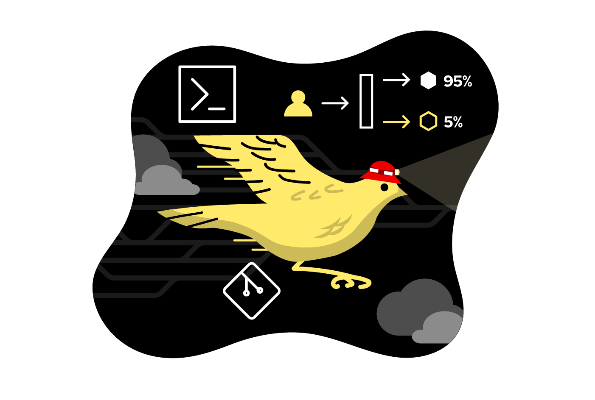
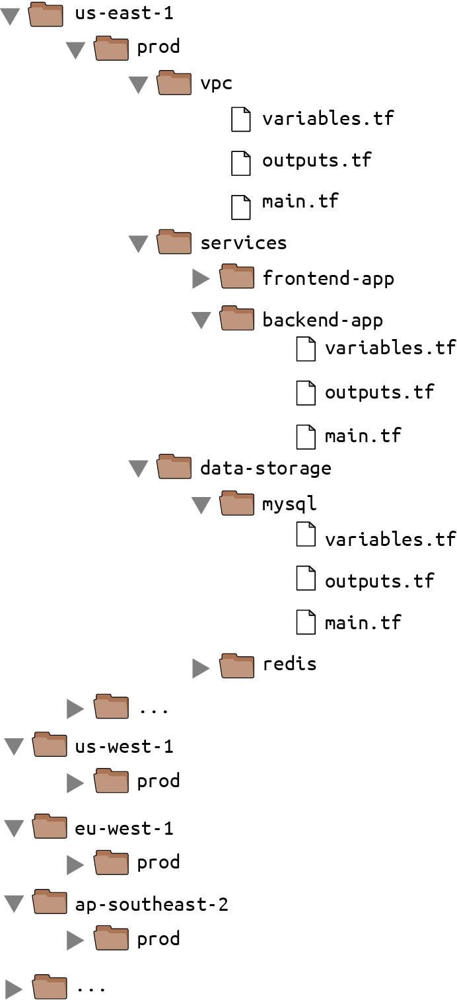
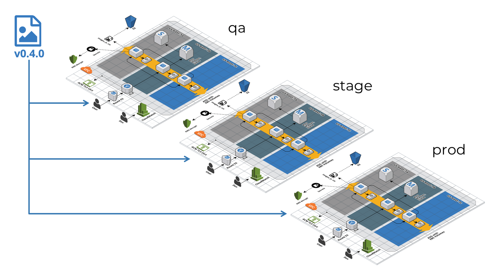
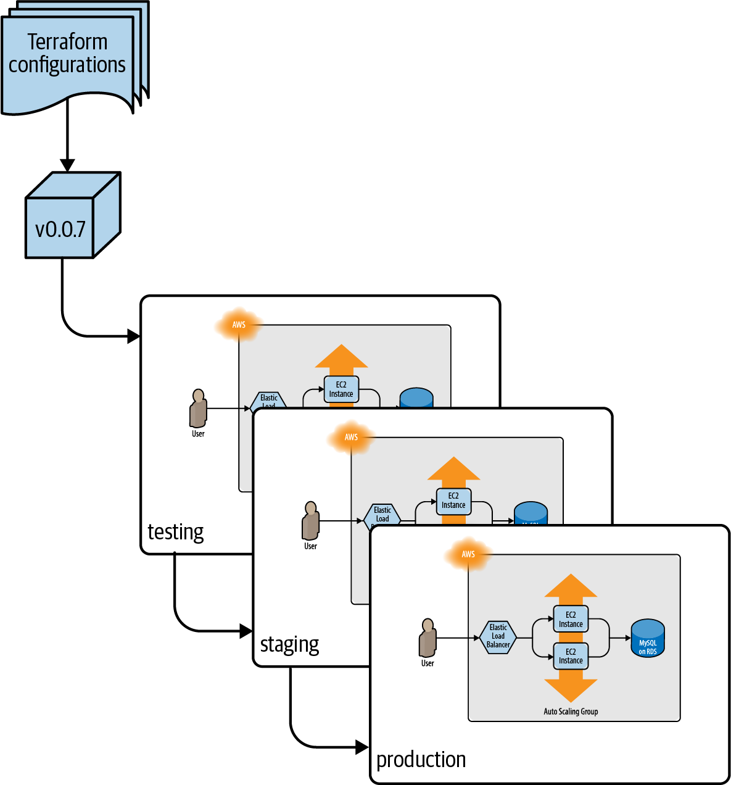

# Chapter 10. How To Use Terraform As A Team

## Adopting IaC in Your Team

The cost of adopting IaC:

- _Skills gap_ ⁉️

  Ops team will need to spend most of its time **writing large amounts of code**: Terraform modules, Go tests, Chef recipes, and so on.

  The move to doing software engineering nearly full time might require learning a number of new skills or hiring new people.

- _New tools_ ✨

  Some developers prefer to stick to what they know and may resist having to invest lots of time and energy learning new languages and techniques.

- _Change in mindset_ 👶

  If your team members are used to managing infrastructure **manually**, they are used to ~~making all of their changes directly~~: for example, by SSHing to a server and executing a few commands.

  The move to IaC requires a shift in mindset where you **make all of your changes indirectly**:

  - first by editing code,
  - then checking it in,
  - and then letting some automated process apply the changes.

  This layer of indirection can be frustrating; for simple tasks, it’ll feel slower than the direct option, especially when you’re still learning a new IaC tool and are not efficient with it.

- _Opportunity cost_ 💸

  What projects will have to be put on hold so that you can migrate to IaC? How important are those projects?

Adopting IaC is a significant investment, and as with any investment, we need to consider not only the potential upside but also the potential downsides.

### Convince Your Boss

If you want to convince your boss that your team should adopt IaC, your goal is:

- not to prove that IaC has value
- but to prove but that **IaC will bring more value to your team than anything else you could work on during that time**.

> **Learn from the salespeople: Focus on the _benefits_**
>
> Instead of talking about what a product can do: `Product X can do Y!`,
>
> take about what the customers can do by using that product: `You can do Y by using product X!`

Let's show the boss Terraform values:

- Instead of: Terraform is declarative, it’s popular, it’s open source
- It should be:
  - Our infrastructure will be far easier to maintain (by using Terraform and it has declarative model).
  - We’ll be able to leverage lots of existing modules and plugins to get things done faster (by using Terraform and it's popular)
  - It's easier to hire new developers for the team from a large, active open source community.

> **Learn from the salespeople: A more effective strategy - Focus on the _problems_**
>
> What is the key problem that customer is trying to solve? What’s the biggest pain point?.
>
> And try to solve their customer’s problems. If that solution happens to include the product they are selling, all the better, but the real focus is on problem solving, not selling.

Let's find out the problem our boss is trying to solve:

- Talk to your boss and understand the most important problems they are working on that quarter of the year.
- If you do find that one of the key problems your boss is focused on can be solved with IaC, then your goal is to show your boss what that world looks like.

For example:

- The biggest issue your boss is focused on this quarter is improving uptime.

  There was many outages, many hours of downtime. Half of these outages were caused by a manual error during deployment.

- Instead of

  - Terraform is declarative (Terraform's ~~feature~~)
  - We can automated the deployment process (Terraform's ~~benefit~~)

- Solve the _problem_:

  - "I have an idea for how to reduce our outages by half."
  - By our research, this can be done with Terraform.

### Work Incrementally

1 out of 10 large projects (greater than $10 million) are completed on time and on budge. [1][1]

If you want to successfully adopt IaC, or if you want to succeed at any other type of migration project, the only sane way to do it is _incrementally_.

The key to _incrementalism_ is:

- not just splitting up the work into a series of small steps
- but splitting up the work in such a way that **every step brings its own value** — even if the later steps never happen.

We don't want to paid a huge cost and received absolutely nothing in return.

We want each part of the project to deliver some value so that even if the project doesn’t finish, no matter what step we got to, it was still worth doing.

👉 The best way to accomplish this is to focus on **solving one, small, concrete problem at a time**, and **deliver value early and often**.

For example:

- Instead of trying to do a “big bang” migration to the cloud, try to

  - identify one, **small, specific app or team** that is struggling,
  - and work to migrate just them.

- Instead of trying to do a “big bang” move to “DevOps,” try to:

  - identify a single, **small, concrete problem** (e.g., outages during deployment)
  - and put in place a solution for that specific problem (e.g., automate the most problematic deployment with Terraform).

### Give Your Team the Time to Learn

Adopting IaC can be a significant investment:

- It’s not something that will happen overnight.
- It’s not something that will happen magically.

It will happen only through a deliberate effort of:

- getting everyone on board,
- making learning resources (e.g., documentation, video tutorials, and, of course, this book!) available,
- and providing dedicated time for team members to ramp up.

If your entire team isn’t on board with it, here’s how it will play out:

1. One developer on the team is passionate about IaC and spends a few months writing beautiful Terraform code and using it to deploy lots of infrastructure.

2. The developer is happy and productive, but unfortunately, the rest of the team did not get the time to learn and adopt Terraform.

3. Then, the inevitable happens: an outage.

   One of your team members needs to deal with it, and they have two options:

   - either (A) fix the outage the way they’ve always done it, by making changes manually, which takes a few minutes
   - or (B) fix the outage by using Terraform, but they aren’t familiar with it, so this could take hours or days.

   Your team members are probably reasonable, rational people and will almost always choose option A.

4. Now, as a result of the manual change, the Terraform code no longer matches what’s actually deployed.

   Therefore, next time someone on your team tries to use Terraform, there’s a chance that they will get a weird error.

   If they do, they will lose trust in the Terraform code and once again fall back to option A, making more manual changes.

   This makes the code even more out of sync with reality, so the odds of the next person getting a weird Terraform error are even higher, and you quickly get into a cycle in which team members make more and more manual changes.

5. In a remarkably short time, everyone is back to doing everything manually, the Terraform code is completely unusable, and the months spent writing it are a total waste.

This scenario happened at many different companies. They have large, expensive codebases full of beautiful Terraform code that are just gathering dust.

To avoid this situation:

- give everyone on the team the time they need to learn the tool and internalize how to use it so that when the next outage happens, it’s easier to fix it in code than it is to do it by hand.

- have a well-defined process for using IaC.

## A Workflow for Deploying Application Code

### Use Version Control

- Checkout a repo

  ```shell
  # git clone <REPO>
  $ git clone https://github.com/brikis98/terraform-up-and-running-code.git
  ```

- Create a branch and switch to it

  ```shell
  # cd <REPO>
  $ cd terraform-up-and-running-code

  # git checkout -b <BRANCH>
  $ git checkout -b example-feature
  ```

### Run the Code Locally

- Run the code:

  ```shell
  $ cd code/ruby/10-terraform/team
  $ ruby web-server.rb

  [2019-06-15 15:43:17] INFO  WEBrick 1.3.1
  [2019-06-15 15:43:17] INFO  ruby 2.3.7 (2018-03-28) [universal.x86_64-darwin17]
  [2019-06-15 15:43:17] INFO  WEBrick::HTTPServer#start: pid=28618 port=8000
  ```

- Manual test with `curl`:

  ```shell
  $ curl http://localhost:8000
  Hello, World
  ```

- Run the automated test:

  ```ruby
  $ ruby web-server-test.rb

  (...)

  Finished in 0.633175 seconds.
  --------------------------------------------
  8 tests, 24 assertions, 0 failures, 0 errors
  100% passed
  --------------------------------------------
  ```

> ℹ️ NOTE
>
> For application workflow, both manual and automated tests for application code can run completely locally on our own computer.

### Make Code Changes

It's real development time.

1. Make code changes:

   ```shell
   $ sed -i "s/Hello, World/Hello World v2/g" web-server.rb
   ```

2. Rerun automated tests:

   ```shell
   $ ruby web-server-test.rb
   ```

3. Regular commit our code:

   ```shell
   $ git commit -m "Updated Hello, World text"
   ```

> ℹ️ NOTE
>
> We want to optimize the feedback loop so that the time between making a change and seeing whether it worked is minimized.

### Submit Changes for Review

Eventually, the code and tests will work the way we want them to, so it’s time to submit your changes for a code review.

- Push the code

  ```shell
  $ git push origin example-feature
  ```

- Create a pull request

  

### Run Automated Tests

Every commit pushed to our repo should trigger the automated tests to run.

> **How to setup commit hooks to run automated tests for every commit pushed to version control system?**
>
> The most common way is to use a _Continuous Integration_ (CI) server, such as `Jenkins`, `CircleCI`, `Github Actions`.

### Merge and Release

Your team members should review your code changes:

- looking for potential bugs
- enforcing coding guidelines
- checking that the existing tests passed,
- and ensuring that you’ve added tests for any new behavior.

If everything looks good, your code can be merged into the main branch.

> **What is code release?**
>
> If we’re using _immutable infrastructure_ practices, releasing application code means **packaging** that code into a **new, immutable, versioned artifact**:
>
> - A new Docker image
> - A new virtual machine image
> - A new `jar` file, a `tar` file
> - etc.
>
> Whatever format you pick, make sure:
>
> - the artifact is immutable (i.e., you never change it)
> - it has a unique version number (so you can distinguish this artifact from all of the others).

For example, if we are packaging our application using Docker, we can store the version number in a Docker tag.

- Using the commit hash:

  - Release the artifact using the commit hash:

    ```shell
    $ commit_id=$(git rev-parse HEAD)
    # For example: 92e3c6380ba6d1e8c9134452ab6e26154e6ad849

    # commit_id=$(git rev-parse --short HEAD)
    # For example: 92e3c63

    $ docker build -t brikis98/ruby-web-server:$commit_id .
    ```

  - Later we can map the Docker image back to the code:

    ```shell
    $ git checkout 92e3c63
    HEAD is now at 92e3c63 Updated Hello, World text
    ```

> 💡 TIP
>
> The commit IDs aren’t very readable or memorable. An alternative is to create a Git tag.

- Using the git tag:

  - Create a git tag

    ```shell
    $ git tag -a "v0.0.4" -m "Update Hello, World text"
    $ git push --follow-tags
    ```

  - Release the artifact using the git tag

    ```shell
    $ git_tag=$(git describe --tags)
    # v0.0.4
    $ docker build -t brikis98/ruby-web-server:$git_tag .
    ```

  - Map back to the code

    ```shell
    $ git checkout v0.0.4
    Note: checking out 'v0.0.4'.
    (...)
    HEAD is now at 92e3c63 Updated Hello, World textF
    ```

### Deploy

#### Deployment tooling

- _Terraform_

  Terraform can deploy certain types of applications.

  For example, if we're using Terraform for an ASG. We can update the `ami` parameter to deploy the new version of our app.

- _Orchestration tools_

  Orchestration tools, such as Kubernetes, AWS ECS, HashiCorp Nomad, Apache Mesos, etc., are use to deploy containerized apps.

- _Scripts:_

  Terraform and most orchestration tools support only a limited set of deployment strategies

  If we have more complicated requirements, we may have to write custom scripts to implement these requirements.

#### Deployment strategies

How do we want our new version to be deployed?

##### Rolling deployment with replacement

⠀⠀⠀⬜⬜⬜

1. ⬜⬜ Undeploy one old copy
2. ⬜⬜✅ Deploy one new copy, wait for it pass health check, send traffic to it
3. Repeat

👉 Ensures that we never have more than the desired copies of the app running

⚠️ Used in case we have:

- limited capacity (e.g. Only 5 physical servers)
- a stateful system where each app has a unique identity (e.g. a consensus systems, such as Apache ZooKeeper)

##### Rolling deployment without replacement

⠀⠀⠀⬜⬜⬜

1. ⬜⬜⬜✅ Deploy one new copy, wait for it pass health check, send traffic to it
2. ⬜⬜✅ Undeploy one old copy
3. Repeat

👉 We never have less than the desired copies of the app running, so we’re not running at a reduced capacity during deployment.

⚠️ Works only if:

- We have flexible capacity (e.g. running in the cloud)
- The app can tolerate more than the desired copies of it running at the same time.

##### Blue-green deployment

⠀⠀⠀🟦🟦🟦

1.  🟦🟦🟦🟢🟢🟢 Deploy the desired number of new copies of the app, wait for all of them to come up and pass health checks,
2.  🔵🔵🔵🟩🟩🟩 Shift all live traffic to the new copies **at the same time**
3.  ⠀⠀⠀⠀⠀⠀ 🟩🟩🟩 Undeploy the old copies.

👉 Only one version of our app is visible to users at any given time and we’re not running at a reduced capacity during deployment.

##### Canary deployment



⠀⠀⠀⬜⬜⬜

1. ⬜⬜⬜🐤 Deploy one new copy of the app, wait for it to come up and pass health checks, start sending live traffic to it
2. Pause the deployment.

   1. Compare the new copy 🐤 ("_canary_") with the old copy ⬜ ("_control_") across various dimensions:

      - CPU usage
      - memory usage
      - latency
      - throughput
      - error rates in the logs
      - HTTP response codes
      - and so on

   2. Make sure that there’s no way to tell the two servers apart. In that case unpause the deployment, and use the `Rolling deployment without replacement` to continue the deployment

   3. If there is any different, cancel the deployment and undeploy the canary 🐤

> Why call it canary deployment?
>
> The name comes from the **“canary in the coal mine”** concept.
>
> 
>
> Miners would take canary birds with them down into the tunnels, and if the tunnels filled with dangerous gases (e.g., carbon monoxide), those gases would affect the canary before the miners, thus providing an **early warning** to the miners that something was wrong and that they needed to exit immediately, before more damage was done.
>
> The canary deployment offers similar benefits, giving you a systematic way to test new code in production in a way that, if something goes wrong, you get a warning early on, when it has affected only a small portion of your users and you still have enough time to react and prevent further damage.

> What is _feature flag_?
>
> We wrap all new features in an if-statement.
>
> By default, the feature flag is set to `false`, so the new feature is off when we deploy the code. Therefore the `canary` server should behave identically to the `control`.
>
> If there were no problems, later we can enable the feature by toggle the feature flag via an internal web interface,

> Why use a canary deployment with feature flag?
>
> By using _feature flag_ with _canary deployment_ we can:
>
> - control which portions of users can use a feature:
>
>   - Only employees.
>   - 1% of users.
>   - 10% of users, etc.
>
> - and separate _deployment new code_ from _release the new features_.

#### Deployment server

> **Where should we run the deployment from?**
>
> We should run the deployment from a CI server.

> **Why should we run the deployment from a CI server?**
>
> - _Fully automated_ 🤖
>
>   To run the deployment from a CI server, we're forced to fully automated the deployment process. The deployment process is captured as code.
>
> - _Consistent environment_ 🍔
>
>   By deploying everything from a CI server, we eliminates all issues cause by the differences of developer's computer:
>
>   - OS, e.g. Mac, Linux, Windows
>   - Dependency versions, e.g. Terraform core
>   - Configurations
>   - What's actually deployed, e.g. code changes that wasn't committed, merged
>   - etc
>
> - _Better permissions management_ 🔐
>
>   We can only give solely the CI server the permissions to deploy, and enforce good security practice a lot more easier.

#### Promotion across environments

If we’re using immutable infrastructure practices, the way to roll out new changes is to **promote the exact same versioned artifact** from one environment to another.

For example, if we have `dev`, `staging`, and `production` environments, to roll out `v2.1.0` of our app, we would do the following:

1. Deploy `v2.1.0` to `dev`.
2. Run manual and automated tests for `dev`.
3. If `v2.1.0` works well in `dev`, promote `v2.1.0` to `stage` by repeating steps 1 and 2 for `stage`.
4. If `v2.1.0` works well in `stage`, promote `v2.1.0` to `production` by repeating steps 1 and 2 for `production`.

## A Workflow for Deploying "Infrastructure Code"

The workflow for Deploying "Infrastructure Code":

1. Use version control
2. Run the code locally
3. Make code changes
4. Submit changes for review
5. Run automated tests
6. Merge and release
7. Deploy

On the surface, it looks identical to the application workflow, but under the hood, there are important differences.

Deploying infrastructure code changes is more complicated, and the techniques are not as well understood.

### Use Version Control

Version control for infrastructure code has a few extra requirements:

- _Live_ repo and _modules_ repo
- Golden Rule of Terraform
- The trouble with branches

#### _Live_ repo and _modules_ repo

For Terraform code, we typically need at least two separate version control repositories:

- `Live` repo: defines the live infrastructure we’ve deployed in each environment (`dev`, `stage`, `prod`, etc.)
- `Modules` repo: for reusable modules, such as `cluster/asg-rolling-deploy`, `data-stores/mysql`, `networking/alb`, and `services/hello-world-app`

One pattern that works well is:

- to have one infrastructure team (Ops team) in our company that specializes in creating reusable, robust, production-grade modules (a Terraform library), or buy one off the shelf.
- all other teams will consume that library to deploy and manage their own infrastructure.

The benefits of this patterns:

- Each team:
  - don't have to spent months assembly the infrastructure from scratch.
  - can work independently
- The Ops team:
  - team can spent all their time writing infrastructure, ensure everything stays consistent and maintainable.
  - aren't the bottleneck because they don't have to deploy and manage infrastructure of all teams.

#### The Golden Rule of Terraform

> What is the _Golden Rule of Terraform_?
>
> The _main branch_ of the live repository should be _a 1:1 representation_ of _what’s actually deployed_ in production.

> What exactly does the _Golden Rule of Terraform_ mean?
>
> - The _main branch_
>
>   All changes that affect the `production` environment should go directly into `main` branch
>
>   In other words, we should run `terraform apply` only for the `production` environment against the `main` branch
>
> - _a 1:1 representation_
>
>   Every resource should have a 1:1 match with some line of code checked into the live repo.
>
>   We should know what's actually deployed be merely looking at the code.
>
>   > ⚠️ WARNING
>   >
>   > If we use Terraform workspaces, with only 1 copy of the codes, we can deployed all environments: `dev`, `stage` ,`prod`...
>   >
>   > By just looking at the code, we can't know which environment we're working on.
>
> - _what's actually deployed_
>
>   The only way to ensures this is to _never make out-of-band changes_.
>
>   After we've used Terraform, don't make any changes from: CLI, Web Console, etc.

> How to know whether we're following the _Golden Rule of Terraform_?
>
> Go to a random folder in live repo, run `terraform plan` and receive `no changes`.

#### The trouble with branches

> **What is the trouble with branches when working with Terraform code?**
>
> Terraform locking mechanisms:
>
> - can help us to prevent concurrent operations on a single workspace.
>
>   Two team members can't run `plan`, `apply` command at the same time.
>
> - but can NOT help us at the level of Terraform code itself.
>
>   Two team members can run `plan`, `apply` command at different time on a different branches (with different code changes.)
>
>   For example:
>
>   

> **How to deal with branches when working with Terraform code?**
>
> Ideally, if everyone reads the `plan`, `apply`'s output carefully, they would see that something's wrong.
>
> But the real answer is: _Don't use branches with Terraform code_.
>
> - Terraform code should be a 1-1 representation of what's actually deployed in the real world.
> - And there's only one real world, so each environments (`dev`, `stage`, `production`) should be deployed from a single branch.

### Run the Code Locally

There is no "localhost" for Terraform.

If we want an environment for Terraform that we can do whatever with it, we need to deployed it to a `sandbox environment`, such as an AWS account dedicated for each developers.

After we have our own developer accounts, and authorized them in the CLI, we can run `terraform apply` in our local machine.

### Make Code Changes

- Make code changes

- Re-deploy the infrastructure

  ```shell
  $ terraform apply
  ```

- Run test to make sure everything is working

  ```go
  go test -v -timeout 30m
  ```

- Commit code

  ```shell
  $ git commit -am "Update Hello World v3"
  ```

### Submit Changes for Review

> **The code review should not be about not ~~_how we write_~~, but be about _what we’re writing_, and _why we're writing that_.**
>
> - ~~_How we write_~~:
>
>   Every team member should write code the same way:
>
>   - Coding guidelines
>   - Style guide
>   - Patterns
>   - Language idioms
>
> - _What we're writing_
>
> - _Why we're writing that_

#### Documentation

All software, including IaC, needs documentation beyond the code itself:

- _Written documentation_

  All Terraform modules should have a README file that explains:

  - _What_ it does
  - _Why_ it exists
  - _How_ to use it
  - _How_ to modify it

  In fact, we should [write the README first](https://tom.preston-werner.com/2010/08/23/readme-driven-development.html). By writing the README file first, we're forced to consider:

  - _What_ we're building
  - _Why_ we're building it

  before get lost in the details of _how_ to build it

  Beyond the basic README, we might also want to have:

  - tutorials
  - API documentation
  - wiki pages
  - design documents that go deeper into how the code works and why it was built this way.

- _Code documentation_

  Don’t use comments to explain what the code does; the code should do that itself.

  Only include comments to offer information that can’t be expressed in code, such as:

  - how the code is meant to be used
  - why the code uses a particular design choice.

- _Example code_

  - highlight the intended usage patterns
  - give your users a way to try your module without having to write any code
  - it’s the main way to add automated tests for the module

#### Automated tests

“How did you test this?”

#### File layout

Enforce the file layout that isolated between:

- different environments, e.g. `dev`, `stage`
- different components, e.g. `vpc`, `rds`

#### Style guide

Use `terraform fmt`. It's the easiest way.

> 💡 TIP
>
> Add `terraform fmt` to a commit hook to ensure a consistent style for the repo.

### Run Automated Tests

_Always run `plan` before `apply`_.

👉 Or more correctly, always read the `plan` output

> 💡 TIP
>
> Use [`atlantis`](https://www.runatlantis.io/) to encourage reading `plan` output, by adding the `plan` output to the merge request.

### Merge and Release

- After:

  - your team members review the code changes and plan output
  - all the tests have passed

- We can merge the changes into the `main` branch:

  ```
  $ git tag -a "v0.0.6" -m "Updated hello-world-example text"
  $ git push --follow-tags
  ```

- And the code is released:

  - Terraform natively supports downloading code from Git.
  - The Git tag acts as the version, immutable artifact.

### Deploy

#### Deployment tooling

We can manually run `terraform apply` to deploy Terraform code.

But there are many other options: Atlantis, Terraform Cloud/Enterprise, Terragrunt, or scripts.

##### Atlantis

Beside adding the `plan` output to merge request, `Atlantis` can also run `terraform apply` for us.

##### Terraform Cloud and Terraform Enterprise

HashiCorp's paid products for deploying Terraform code.

##### Terragrunt

Terragrunt is an open-source wrapper for Terraform.

Terragrunt supports deploy versioned Terrafrom code across multiple environments with minimal copying and pasting.

##### Scripts

We can write scripts in Bash, Ruby... to deploy Terraform code.

#### Deployment strategies

For most types of infrastructure changes, Terraform doesn’t offer any built-in deployment strategies

For example, there’s no way to do:

- a blue-green deployment for a VPC change
- feature toggle a database change.

Terraform _does not roll back automatically in case of errors_. Because there is no reasonable way to roll back many types of infrastructures.

We should expect errors, and handle it ourself:

- _Retries_

  Many Terraform errors can be solved just by rerunning `terraform apply` and praying 🙏.

- _Terraform state errors_

  Sometimes, `terraform` has `apply` but failed to save the state to remote backend.

  - Terraform will save the state to local disk in a file named `errored.tfstate`
  - We can run `state push` on the CI server to update the state in the remote backend.

    ```shell
    $ terraform state push errored.tfstate
    ```

- _Error releasing locks_

  Sometimes, `terraform` will fail to release the lock. And the state will be permanently locked.

  We need to manually run `force-unlock` to release the lock

  ```shell
  $ terraform force-unlock <LOCK_ID>
  ```

#### Deployment server

Just as with application code, all of the infrastructure code changes should be applied from a CI server and not from a developer’s computer.

But permissions to deploy infrastructure code are quite a bit trickier than for application code:

- The CI server for application code only need a minimal set of permissions.
- The CI server for infrastructure code needs `admin` permissions.

To minimize the risks of CI server for infrastructure, we can:

- _Lock the CI server down_

- _Don’t expose your CI server on the public internet_

  Run the CI server in a private subnet, so it's accessible only over a VPN.

- _Enforce an approval workflow_

- _Don’t give the CI server permanent credentials_

- _Don’t give the CI server admin credentials_

#### Promote artifacts across environments

**Always test Terraform changes in _pre-prod before prod_**

The process for promoting Terraform code across environments is similar to the process of promoting application artifacts, except there is an extra approval step, where you run `terraform plan` and have someone manually review the output and approve the deployment.

For example, here’s the process for promoting, for instance, `v0.0.6` of a Terraform module across the `dev`, `stage`, and `prod` environments:

1. Update the `dev` environment to `v0.0.6`, and run `terraform plan`.
2. Prompt someone to review and approve the plan; for example, send an automated message via Slack. 👈 EXTRA STEP
3. If the plan is approved, deploy `v0.0.6` to `dev` by running `terraform apply`. 👈 EXTRA STEP
4. Run your manual and automated tests in `dev`.
5. If `v0.0.6` works well in `dev`, repeat **steps 1–4** to promote `v0.0.6` to `staging`.
6. If `v0.0.6` works well in `staging`, repeat **steps 1–4** again to promote `v0.0.6` to `production`.

## Terragrunt

The biggest problem remaining is the duplication between environments in the `live` repo.



The `live` repo has a large number of regions, and within each region, a large number of modules, most of which are copied and pasted.

There are a lot boilerplate that duplicate between each environments:

- The `provider` configuration
- The `backend` configuration
- The `input variables` to pass to the module
- The `output variables` to proxy from the module

To make these code DRY, and to make it easier to promote `Terraform` code across environments, we can use [`Terragrunt`](https://github.com/gruntwork-io/terragrunt).

`Terragrunt` is a thin wrapper for `Terraform`, that means we run all the standard `terraform` commands, except we use `terragrunt` as the binary:

```shell
$ terragrunt plan   # Instead of `terraform plan`
$ terragrunt apply  # Instead of `terraform apply`
$ terragrunt output # Instead of `terraform output`
```

`Terragrunt` will forward almost all commands, arguments, and options directly to `Terraform`, but based on the settings in your `terragrunt.hcl` file.

With `terragrunt`, we can replace all `tf` files in each root modules in the `live` repo with a `terragrunt.hcl` file.

---

For example, an infrastructure for 3 environments looks like this:



---

With only Terraform:

- The folder layout:

  ```shell
  ├── prod
  │   ├── app
  │   │   ├── main.tf
  │   │   ├── variables.tf
  │   │   └── outputs.tf
  │   ├── mysql
  │   │   ├── main.tf
  │   │   ├── variables.tf
  │   │   └── outputs.tf
  │   └── vpc
  │       ├── main.tf
  │       ├── variables.tf
  │       └── outputs.tf
  ├── qa
  │   ├── app
  │   │   ├── main.tf
  │   │   ├── variables.tf
  │   │   └── outputs.tf
  │   ├── mysql
  │   │   ├── main.tf
  │   │   ├── variables.tf
  │   │   └── outputs.tf
  │   └── vpc
  │       ├── main.tf
  │       ├── variables.tf
  │       └── outputs.tf
  └── stage
      ├── app
      │   ├── main.tf
      │   ├── variables.tf
      │   └── outputs.tf
      ├── mysql
      │   ├── main.tf
      │   ├── variables.tf
      │   └── outputs.tf
      └── vpc
          ├── main.tf
          ├── variables.tf
          └── outputs.tf
  ```

- With only Terraform, each root module of each `environment` - `module`:

  - `prod` environment

    - `app` module:

      - `main.tf`

        ```t
          # prod/app/main.tf
          provider "aws" {} # 👈 `provider` block - DUPLICATE FOR EACH ENVIRONMENT - MODULE

          terraform {
            backend "s3" {}  # 👈 `backend` block - DUPLICATE FOR EACH ENVIRONMENT - MODULE
          }

          module "app" {
            source = "../../../app"
            instance_count = 10
            instance_type  = "m4.large"
            # ... other app settings ...
          }
        ```

      - `outputs.tf`

        ```t
        # prod/app/outputs.tf
        output "url" { # 👈 `output` block - DUPLICATE FOR EACH ENVIRONMENT - MODULE
          value = module.app.url
        }
        ```

      - Other `tf` files

    - Other `module`s

  - `stage` environment

    - `app` module:

           - `main.tf`

             ```t
               # stage/app/main.tf
               provider "aws" {} # 👈 PROVIDER BLOCK - DUPLICATE FOR EACH ENVIRONMENT - MODULE

               terraform {
                 backend "s3" {} # 👈 BACKEND BLOCK - DUPLICATE FOR EACH ENVIRONMENT - MODULE
               }

               module "app" {
                 source = "../../../app"
                 instance_count = 2
                 instance_type  = "t2.medium"
                 # ... other app settings ...
               }
             ```

           - Other `tf` files

  - `qa` environment

    - `app` module:

      - `main.tf`

      - Other `tf` files

  - Other `environment`s

    - `module`s...

      - `tf` files

---

With Terragrunt:

- The folder layout:

  ```shell
  # infrastructure-live
  ├── terragrunt.hcl # 👈 All modules in all environments inherit this
  ├── prod
  │   ├── terragrunt.hcl # 👈 All modules in `prod` environment inherit this
  │   ├── app
  │   │   └── terragrunt.hcl
  │   ├── mysql
  │   │   └── terragrunt.hcl
  │   └── vpc
  │       └── terragrunt.hcl
  ├── qa
  │   ├── terragrunt.hcl # 👈 All modules in `qa` environment inherit this
  │   ├── app
  │   │   └── terragrunt.hcl
  │   ├── mysql
  │   │   └── terragrunt.hcl
  │   └── vpc
  │       └── terragrunt.hcl
  └── stage
      ├── terragrunt.hcl # 👈 All modules in `stage` environment inherit this
      ├── app
      │   └── terragrunt.hcl
      ├── mysql
      │   └── terragrunt.hcl
      └── vpc
          └── terragrunt.hcl
  ```

- The differ between environments can be exposed as input variables:

  ```t
  # infrastructure-modules/app/main.tf
  provider "aws" { # TODO: Check if this `provider` block is necessary
    region = "us-east-1"
    # ... other provider settings ...
  }

  terraform {
    backend "s3" {} # TODO: Check if this `backend` block is necessary
  }

  module "app" {
    source = "../../../app"
    instance_type  = var.instance_type
    instance_count = var.instance_count
    # ... other app settings ...
  }
  ```

  ```t
  # infrastructure-modules/app/variables.tf
  variable "instance_type" {}
  variable "instance_count" {}
  ```

  ```t
  # infrastructure-modules/app/outputs.tf
  output "url" {
    value = module.app.url
  }
  ```

- Each module only needs one file - `terragrunt.hcl`:

  - `terragrunt.hcl`: 👈 All modules in all environments inherit this config; this will [keep **Terragrunt Architecture DRY**](https://terragrunt.gruntwork.io/docs/features/keep-your-terragrunt-architecture-dry/)

  - `prod` environment

    - `terragrunt.tf`: 👈 All modules in `prod` environment inherit this config; this will [keep **Terraform code DRY** for all modules in an environemnt](https://terragrunt.gruntwork.io/docs/features/keep-your-terraform-code-dry/#dry-common-terraform-code-with-terragrunt-generate-blocks)

      - `remote_state` block: 👈 [Keep **remote state configuration DRY**](https://terragrunt.gruntwork.io/docs/features/keep-your-remote-state-configuration-dry/)

        ```t
        remote_state { # 👈 Terragrunt will manage the S3 bucket (and the DynamoDB table) for us
          backend = "s3"

          generate = {
            path      = "backend.tf"
            if_exists = "overwrite"
          }

          config = {
            bucket         = "my-terraform-state-prod"                         # 👈 We only need to hard code this value once for each environment
            key            = "${path_relative_to_include()}/terraform.tfstate" #
            region         = "us-east-1"                                       # 👈 We only need to hard code this value once for each environment
            encrypt        = true                                              #
            dynamodb_table = "my-lock-table-prod"                              # 👈 We only need to hard code this value once for each environment
          }
        }
        ```

        > **What is `path_relative_to_include` function?**
        >
        > A Terragrunt built-in function
        >
        > [`path_relative_to_include`](https://terragrunt.gruntwork.io/docs/reference/built-in-functions/#path_relative_to_include)() returns the relative path between the current `terragrunt.hcl` file and the path specified in its `include` block

    - `app` module:

      - `terragrunt.tf`: 👈 [**Keep Terraform code DRY** for the same module in all environemnts](https://terragrunt.gruntwork.io/docs/features/keep-your-terraform-code-dry/)

        ```t
        # infrastructure-live/prod/app/terragrunt.hcl
        terraform { # `terraform` block specifies where to download the Terraform code
          source = "github.com:foo/infrastructure-modules.git//app?ref=v0.0.1"
        }

        include "root" {
          path = find_in_parent_folders()
        }

        inputs = { # `inputs` block specifies environment-specific values for the input variables in that Terraform code
          instance_count = 10
          instance_type  = "m4.large"
        }
        ```

        > **What is `find_in_parent_folders` function?**
        >
        > The [`find_in_parent_folders`](https://terragrunt.gruntwork.io/docs/reference/built-in-functions/#find_in_parent_folders)() function will automatically search up the directory tree to find the root `terragrunt.hcl` and inherit the `remote_state` configuration from it.

    - Other `module`s

- `stage` environment

  - `app` module:

    - `terragrunt.tf`

      ```t
      # infrastructure-live/stage/app/terragrunt.hcl

      terraform {
        source = "github.com:foo/infrastructure-modules.git//app?ref=v0.0.1"
      }

      inputs = {
        instance_count = 2
        instance_type  = "t2.medium"
      }
      ```

  - Other `module`s

> **How does `terragrunt` work under the hood?**
>
> For example, this is how `terragrunt apply` works:
>
> 1. Read the `terragrunt.hcl` file in the folder where we ran `apply`.
> 2. Pull in all the settings from the included **root** `terragrunt.hcl` file.
> 3. Download the Terraform code specified in the source URL into the `.terragrunt-cache` scratch folder.
> 4. Generate a `backend.tf` file with your backend configuration.
> 5. Detect that `init` has not been run and run it automatically
>
>    Terragrunt will even create your S3 bucket and DynamoDB table automatically if they don’t already exist.
>
> 6. Run `apply` to deploy changes.

## Putting It All Together

Application and infrastructure code workflows:

|                           | Application code                                                                                                                                                                                                                                                                                                                                                              | Infrastructure code                                                                                                                                                                                                                                                                                                                                                                                                                                                                                                                                                                                   |
| ------------------------- | ----------------------------------------------------------------------------------------------------------------------------------------------------------------------------------------------------------------------------------------------------------------------------------------------------------------------------------------------------------------------------- | ----------------------------------------------------------------------------------------------------------------------------------------------------------------------------------------------------------------------------------------------------------------------------------------------------------------------------------------------------------------------------------------------------------------------------------------------------------------------------------------------------------------------------------------------------------------------------------------------------- |
| Use version control       | • `git clone` <br>• One repo 🗃️ per app <br>• Use branches 🔀                                                                                                                                                                                                                                                                                                                 | • `git clone` <br>• `live` and `modules` repos 🗃️🗃️<br>• Don’t use branches ➡️                                                                                                                                                                                                                                                                                                                                                                                                                                                                                                                        |
| Run the code locally      | • Run on localhost <br>• `ruby web-server.rb` <br>• `ruby web-server-test.rb`                                                                                                                                                                                                                                                                                                 | • Run in a sandbox environment 📦<br>• `terraform apply` <br>• `go test`                                                                                                                                                                                                                                                                                                                                                                                                                                                                                                                              |
| Make code changes         | • Change the code <br>• `ruby web-server.rb` <br>• `ruby web-server-test.rb`                                                                                                                                                                                                                                                                                                  | • Change the code <br>• `terraform apply` <br>• `go test` <br>• Use test stages 🪜                                                                                                                                                                                                                                                                                                                                                                                                                                                                                                                    |
| Submit changes for review | • Submit a pull request <br>• Enforce coding guidelines                                                                                                                                                                                                                                                                                                                       | • Submit a pull request <br>• Enforce coding guidelines                                                                                                                                                                                                                                                                                                                                                                                                                                                                                                                                               |
| Run automated tests       | • Tests run on CI server <br>• Unit tests <br>• Integration tests <br>• End-to-end tests <br>• Static analysis                                                                                                                                                                                                                                                                | • Tests run on CI server <br>• Unit tests <br>• Integration tests <br>• End-to-end tests <br>• Static analysis <br>• `terraform plan`                                                                                                                                                                                                                                                                                                                                                                                                                                                                 |
| Merge and release         | • `git tag` <br>• Create versioned, immutable artifact                                                                                                                                                                                                                                                                                                                        | • `git tag` <br>• Use repo with tag as versioned, immutable artifact 🆓                                                                                                                                                                                                                                                                                                                                                                                                                                                                                                                               |
| Deploy                    | • Deploy with Terraform, orchestration tool (e.g., Kubernetes, Mesos), scripts <br>• Many deployment strategies: rolling deployment 🎢, blue-green 🟦🟩, canary 🐦 <br>• Run deployment on a CI server <br>• Give CI server limited permissions 👶 <br>• Promote immutable, versioned artifacts across environments <br>• Once a pull request is merged, deploy automatically | • Deploy with Terraform, Atlantis, Terraform Cloud, Terraform Enterprise, Terragrunt, scripts <br>• Limited deployment strategies (make sure to handle errors ❌: retries 🔁, `errored.tfstate`! 🔓) <br>• Run deployment on a CI server <br>• Give CI server temporary credentials 🛂 solely to invoke a separate, locked-down worker 🔐 that has admin permissions 👨 <br>• Promote immutable, versioned artifacts across environments <br>• Once a pull request is merged, go through an approval workflow where **someone checks the plan output one last time** 🩻, and then deploy automatically |

With these 2 workflows, we have a well-defined process for application and infrastructure code, that can used to promote artifacts across environments.



## Conclusion

**The power of Terraform**, or more generally, Infrastructure as Code, is we can apply all the power of _software engineering_ for the infrastructure:

- modules 🧩
- code review 👀
- version control 💾
- testing ✅
- etc

If Terraform is used correctly, our team can:

- deploy faster ⚡
- respond to changes more quickly 🚀

Hopefully, deployments will become boring 🥱, and we can spend more time to improve 💹 the infrastructure instead of managing it by hand 🫱.

[1]: https://www.standishgroup.com/sample_research_files/CM2013-8+9.pdf
